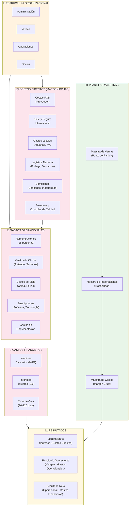

# CFOremoto - Kick Off PromoSmart
## Comprensión del Modelo de Negocio y Fuentes de Datos

> **Propósito:** Este documento proporciona al equipo de CFOremoto una comprensión completa del modelo de negocio de PromoSmart, sus estructuras de costos, equipos organizacionales y fuentes de datos actuales para facilitar la implementación de soluciones financieras efectivas.

---

## 1. Modelo de Negocio de PromoSmart

### 1.1 Visión General
**PromoSmart** es una empresa B2B líder en productos promocionales con sede en Chile, Perú y Colombia, especializada en la importación y distribución de mercancía promocional bajo un modelo **"Made to Order"** (MTO) que mantiene inventario relativo cero.

**Propuesta de Valor:**
Nuestra propuesta integra asesoría experta en marketing, abastecimiento directo con fabricantes de calidad en China y gestión integral de la cadena de suministro internacional. Operamos con inventario prácticamente cero para reducir riesgos, y cuidamos el proceso de producción para cerrar la brecha entre lo esperado y lo entregado. Trabajamos en modalidad Made to Order con venta calzada: producimos solo lo que ya está vendido.

### 1.2 Modelo de Ingresos y Facturación

**Proceso de Venta:**
El ciclo comienza con el levantamiento del requerimiento por el equipo comercial y la preparación de una propuesta personalizada con su respectiva cotización. Tras la aprobación del cliente se ejecuta la producción con seguimiento y controles de calidad, finalizando con la entrega en tiempo y forma.

**Proceso de Facturación:**
Habitualmente facturamos contra entrega. En escenarios de crecimiento aplicamos un esquema alternativo 50% al confirmar la orden y 50% a 30 días. Cada pedido se factura como un proyecto, el cual puede incluir múltiples productos.

---

## 2. Estructura Organizacional

### 2.1 Composición General
La empresa cuenta con 18 personas distribuidas entre Chile (sede principal), Perú y Colombia.

### 2.2 División Organizacional
La organización se estructura en tres áreas: Administración con 3 personas, Ventas con 6 personas y Operaciones con 9 personas.

---

## 3. Estructura de Costos y Gastos

### 3.1 Costos Directos del Producto (Margen Bruto)
El margen bruto considera los costos FOB del proveedor (matricería, setups y fabricación, mayormente en condición FOB y ocasionalmente EX Factory), el flete y seguro internacional, los gastos locales de importación como aduanas, IVA y liquidaciones, la logística nacional de recepción y despacho, las comisiones de plataformas y bancos, las muestras de preproducción y los controles de calidad y procesos especiales requeridos por los clientes.

### 3.2 Estructura de Gastos Operacionales
Los gastos operacionales se concentran en remuneraciones de la dotación, costos de oficina —arriendos, bodegas, servicios y estacionamientos—, viajes y beneficios de RRHH, suscripciones de software y representación comercial asociada a clientes y eventos.

### 3.3 Resultado Operacional
El ciclo de caja estimado es de 90 a 120 días. Los pagos típicos son 30% al contado y 70% contra embarque al proveedor, flete y seguro a 30 días, gastos locales al contado y servicios logísticos a 30 días. Los clientes pagan contra entrega o bajo el esquema 50% al confirmar y 50% a 30 días. El financiamiento combina líneas bancarias con tasas cercanas a 0.8% mensual y préstamos de terceros entre 0.6% y 1.5%, con capacidad aproximada de hasta 1.000 millones de CLP.

---

## 4. Fuentes de Datos y Registros Diarios

### 4.1 Planillas Maestras Principales (Prioritarias)

#### **Maestra de Ventas**
- **Propósito:** Registro de todas las notas de venta emitidas
- **Funcionalidad:** Cada nota de venta funciona como punto de partida para el resto de los procesos
- **Contenido:** Código, cliente, producto, cantidades, precios, fechas de compromiso, estado de facturación
- **Responsable:** Área de Ventas
- **Frecuencia de Actualización:** Diaria

#### **Maestra de Importaciones**
- **Propósito:** Contiene las órdenes de compra asociadas a cada nota de venta
- **Funcionalidad:** Permite hacer trazabilidad de cada pedido desde su origen hasta su arribo
- **Contenido:** PO, producto, cantidades, precios, estado de producción, hitos de calidad, carta Gantt
- **Responsable:** Área de Operaciones - Producción
- **Frecuencia de Actualización:** Diaria

#### **Maestra de Costos**
- **Propósito:** Registra los costeos asociados a cada orden de compra
- **Funcionalidad:** Vincula los valores de importación con la respectiva nota de venta, generando así la base del margen bruto
- **Contenido:** Cotización de todos los costos de un proyecto (producto, proveedor, materiales, dimensiones, unidades, costos por etapa)
- **Responsable:** Área de Operaciones - Compras
- **Frecuencia de Actualización:** Semanal

### 4.2 Interacción entre las Tres Planillas Maestras

**Flujo de Integración:**
1. **Maestra de Ventas** → Genera nota de venta confirmada
2. **Maestra de Importaciones** → Crea órdenes de compra asociadas a la nota de venta
3. **Maestra de Costos** → Registra costeos de cada orden de compra
4. **Resultado:** Trazabilidad completa desde venta hasta costo, generando base del margen bruto

**Ejemplo Práctico:**
- Cliente solicita 1000 camisetas promocionales
- **Maestra de Ventas:** Registra nota de venta NV-001 por $50,000
- **Maestra de Importaciones:** Crea PO-001 para 1000 camisetas
- **Maestra de Costos:** Registra costeo total de $35,000 (FOB + flete + gastos)
- **Margen Bruto:** $15,000 (30% sobre venta)

### 4.3 Planillas Secundarias Complementarias

#### **Comerciales**
La capa comercial incluye la planificación de ventas y el soporte para la facturación.

#### **Producción**
Producción integra la coordinación de despachos, inspecciones de calidad en origen, seguimiento de embarques y gestión de cronogramas.

#### **Administración**
Administración consolida las provisiones y liquidaciones de costos, los registros de pagos y conciliaciones bancarias, los contratos forward y la gestión de gastos y créditos.

 

 

---

## 5. Mapa Visual del Modelo de Negocio

---

## 6. Documentos Anexos

Junto con este documento se entregará una versión Lite de nuestras tres principales planillas maestras:

### **Maestra de Ventas**
- Registro de todas las notas de venta emitidas
- Cada nota de venta funciona como punto de partida para el resto de los procesos

### **Maestra de Importaciones**
- Contiene las órdenes de compra asociadas a cada nota de venta
- Permite hacer trazabilidad de cada pedido desde su origen hasta su arribo

### **Maestra de Costos**
- Registra los costeos asociados a cada orden de compra
- Vincula los valores de importación con la respectiva nota de venta, generando así la base del margen bruto

**Interacción entre Planillas:**
La nota de venta registrada en la Maestra de Ventas se conecta con sus órdenes de compra en la Maestra de Importaciones y con sus costeos en la Maestra de Costos. De esta manera, estas tres planillas interactúan entre sí, entregando una visión integral del ciclo de negocio: desde la venta al cliente, pasando por la gestión de compras internacionales, hasta la imputación de los costos.

Además de estas tres grandes planillas, existen varias planillas secundarias que complementan la gestión. Estas también pueden revisarse en caso de ser necesario, pero la prioridad de esta entrega es que el equipo logre comprender de manera resumida y con un ejemplo práctico cómo interactúan las tres planillas principales entre sí.

---

*Este documento servirá como base para las discusiones iniciales con el equipo de CFOremoto y deberá ser actualizado conforme se obtenga información adicional específica de PromoSmart.*